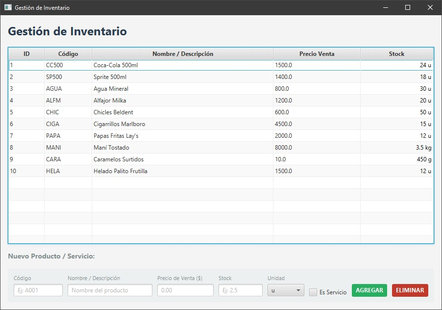
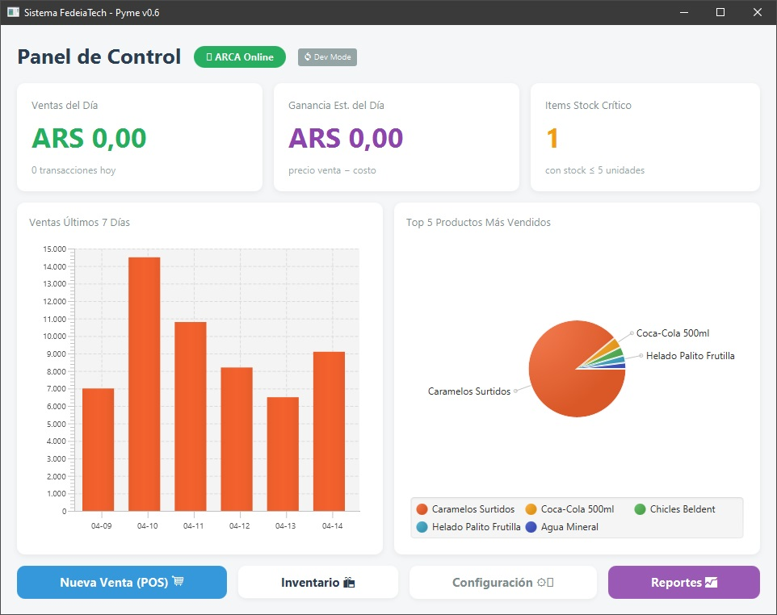
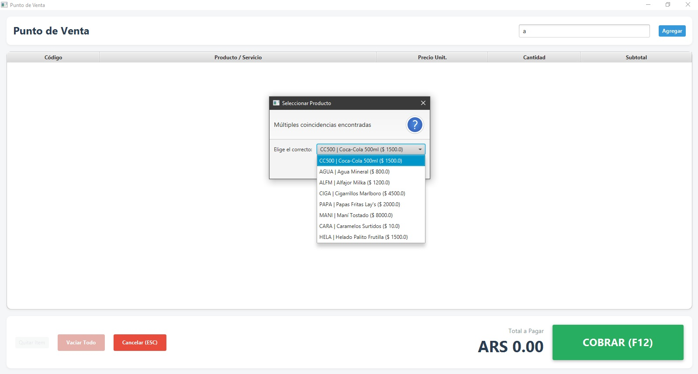

<div align="center">


# Hola, soy Federico Iacono 👋

[](https://git.io/typing-svg)

[](https://www.linkedin.com/in/fedeiacono/)
[](https://fedeiatech.vercel.app)
[](https://github.com/FedeiaTech)


</div>

---

## 🧠 Sobre mí

Apasionado por construir puentes entre **Inteligencia Artificial**, **Sistemas Empresariales** y **Game Dev**. Estudiante de la **UTN** con foco en crear software que tenga impacto real — desde motores de gestión hasta experiencias web interactivas.

```javascript
const fede = {
  ubicacion:   "Argentina 🇦🇷",
  universidad: "UTN — Técnico en Programación",
  enfoque:     ["Web Dev", "Enterprise Systems", "Game Dev", "AI"],
  abierto_a:   "Colaboraciones, proyectos y nuevas ideas 🚀"
};
```

---

## 🛠️ Tech Stack

| Área | Tecnologías |
| :--- | :--- |
| **Frontend** |      |
| **Backend & BD** |     |
| **Game Dev** |    |
| **Diseño & Tools** |       |

---

## 🚀 Proyectos Destacados

<table>
  <tr>
    <td width="50%">
      <h3 align="center">🏗️ JFX Business Engine</h3>
      <p align="center">
        
      </p>
      <p align="center">
        Sistema de gestión comercial para PyMEs argentinas. POS con tickets PDF, inventario por unidades (u/kg/g/lt), dashboard con KPIs y gráficos, export a Excel y datos offline.
      </p>
      <p align="center">
        
        
        
        
      </p>
      <p align="center">
        
        
      </p>
      <p align="center"><sub>🔒 Proyecto comercial privado — en desarrollo activo</sub></p>
    </td>
    <td width="50%">
      <h3 align="center">🌐 FedeiaTech — Portfolio Web</h3>
      <p align="center">
        Sitio web interactivo y animado que funciona como portfolio profesional. Diseño moderno con transiciones fluidas, secciones dinámicas y despliegue en Vercel.
      </p>
      <p align="center">
        
        
        
      </p>
      <p align="center">
        <a href="https://fedeiatech.vercel.app">🔗 Ver en vivo</a>
      </p>
    </td>
  </tr>
</table>

---

## 📊 GitHub Stats

<div align="center">

<a href="https://github.com/FedeiaTech">
  
  
</a>


</div>

---

## 📈 Actividad


---

<div align="center">

*"Build things. Break things. Learn. Repeat."*

</div>
